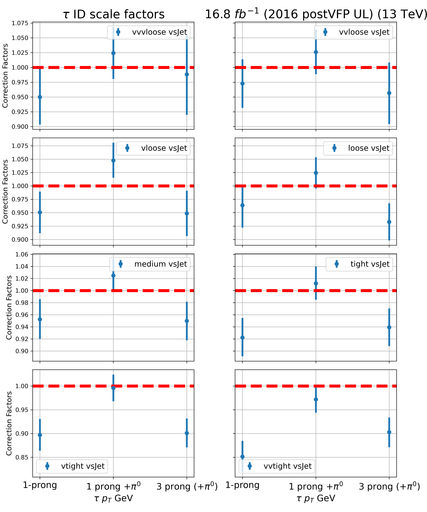
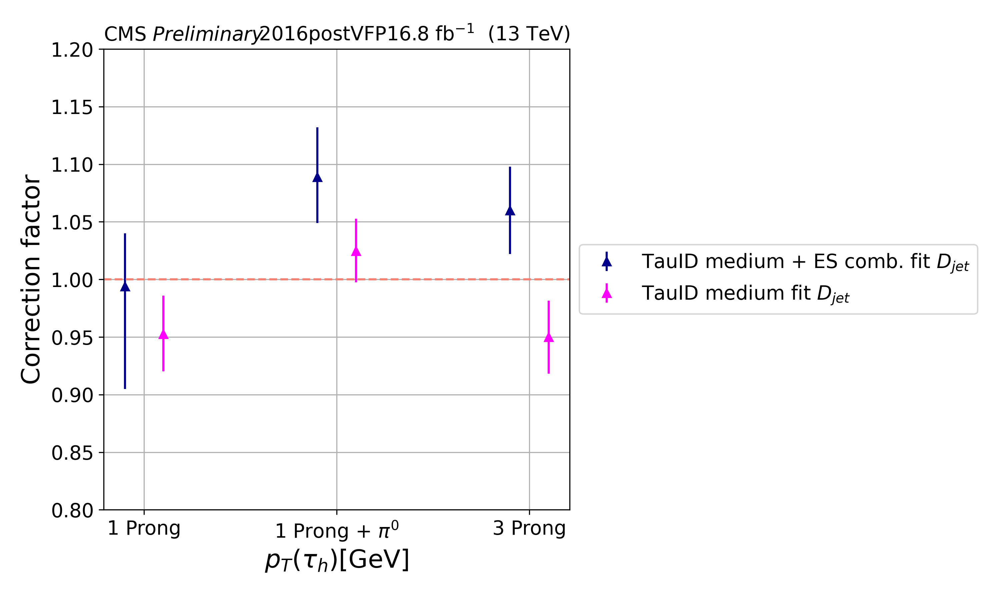

# scale_factors_utils
Complementary scripts for scale factors visual representation 

`read_sfs_json.py` is a script to retrieve tauid scale factors from json correctionlib file

Exaple of usage:

```
python3 read_sf_json.py --wp medium --era 2016preVFP --channel mt --round_to 5 --user_out_tag tauid_preVFP_v1
```

The user should specify `vs_jet` working poing `--wp` (tight/metium/loose/etc), data taking period `--era`,
the result could be rounded to the digit `--round_to` and tag which was used for scale factors computation
also should be used `--user_out_tag`     


Then one can plot scale factors as a function of pT and decay mode with the usage of `sim_fit_v1.py`:

```
python3 sim_fit_v1.py
```

User can get the following pictures using previous command:



scale factors should be copied as an input lists but this should be improved 

This script works with hardcoded scale factors (but still need to fix correctionlib creation)

```
python3 full_range_plot_pt.py --era 2016postVFP
```

```
python3 dm_scale_factors.py --era 2016postVFP
```

User can also compare two versions of different scale factors DM-wise (hardcoded for now):


```
python3 with_without_es.py
```

As the output, user gets the following file:

